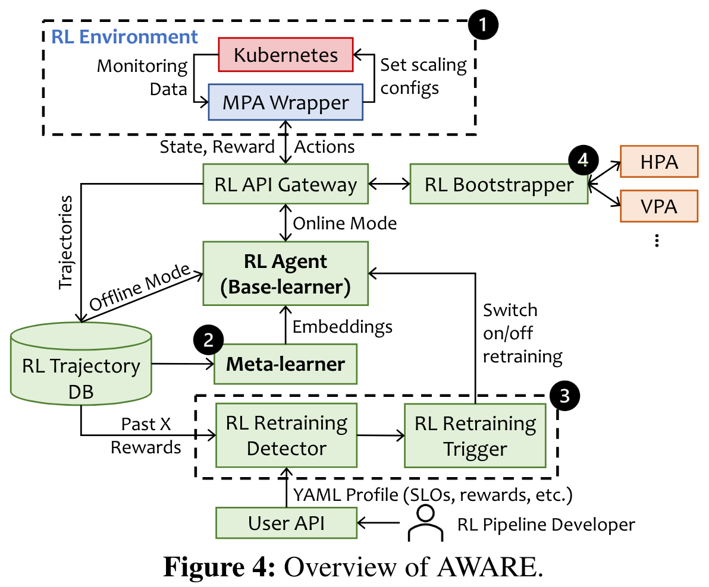
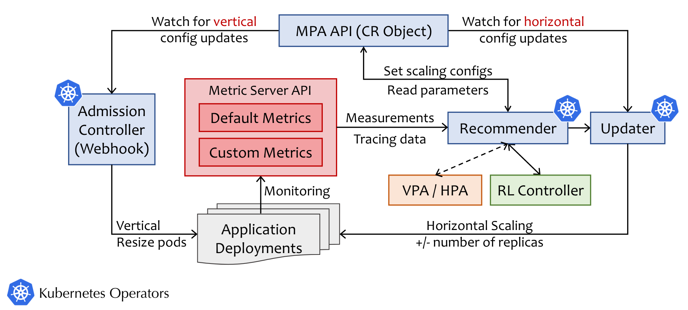
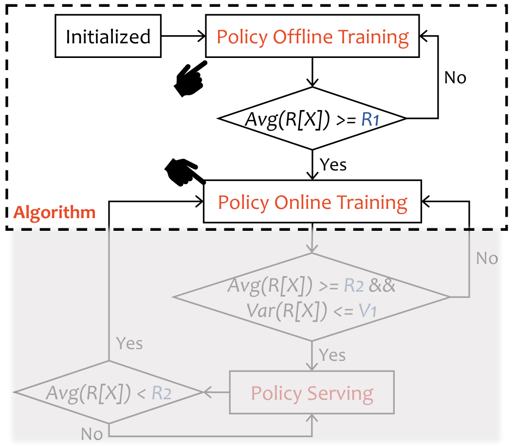
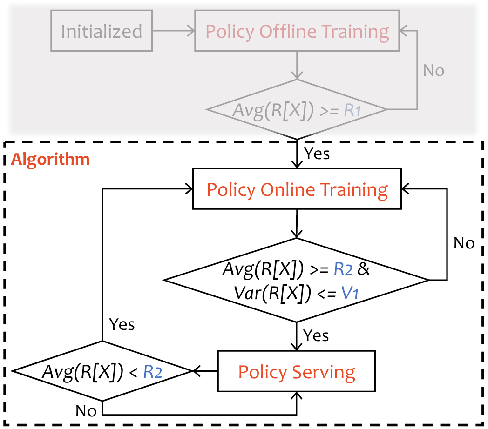
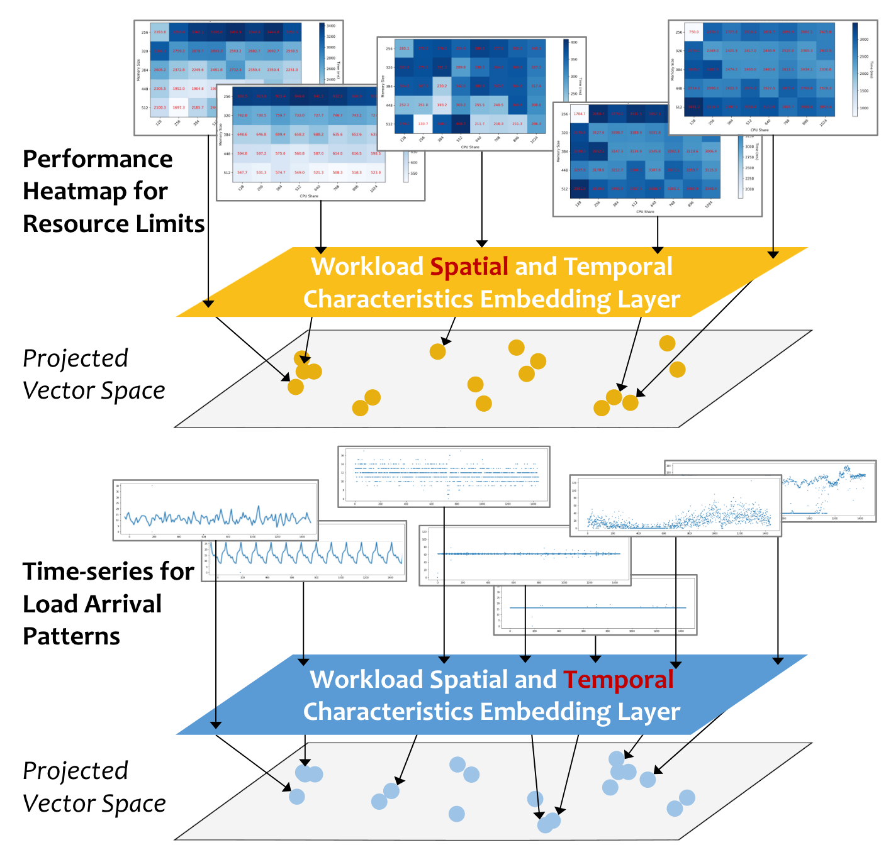
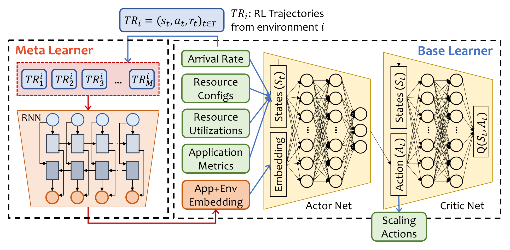
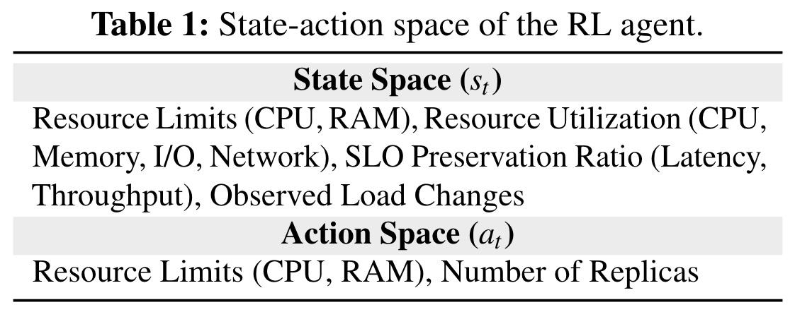
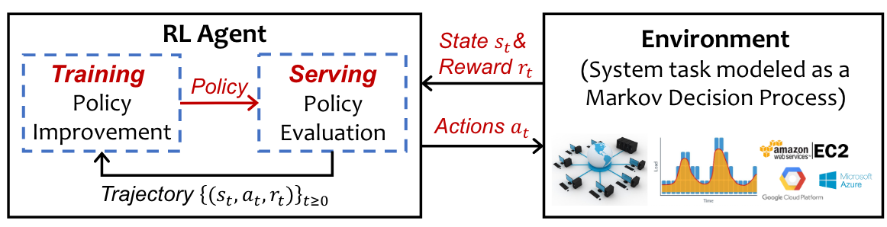

<link rel="stylesheet" type="text/css" href="../css/auto-title-number.css" />

> 在生产云系统中通过强化学习实现工作负载的自动扩展

<!-- ###### 说明： -->

<!-- more -->

### 目录

- [Motivation](#motivation)
- [Challenge](#challenge)
- [Objective](#objective)
- [AWARE](#aware)
  - [Overview](#overview)
  - [MPA](#mpa)
  - [RL Training Bootstrap](#rl-training-bootstrap)
  - [RL Retraining Detector and Trigger](#rl-retraining-detector-and-trigger)
  - [Meta-learner](#meta-learner)
  - [Model Architecture](#model-architecture)
- [Reflections](#reflections)
- [Supplementary](#supplementary)
  - [Reinforcement Learning](#reinforcement-learning)

## Motivation

云系统管理任务中充满了连续决策过程，如资源管理、作业调度、拥塞控制。这些问题建模困难，现有的大多数的方法依赖于启发式算法或人工设置规则。
RL（Reinforcement Learning）擅长学习最优策略，它将系统任务建模为一个连续决策问题，并为搜索state-action空间和生成最优策略提供了一个紧密的反馈回路，无需依赖不准确的假设。将 RL 与生产系统中复杂的系统管理任务相结合，可以：
- 充分利用有关应用程序和基础设施的大量监控数据；
- 自动执行最优策略的制定过程，同时将操作员从手动工作负载剖析和参数调整/测试中解放出来。

## Challenge
- 学习到的RL策略是针对特定工作负载和底层基础设施的，在异构和动态演进（e.g.多云）的数据中心里，需要重新训练；
- 即使对于相同的应用和环境，也可能会出现细微的变化（补丁、滚动更新）、未见的异常工作负载模式、流量抖动，需要及时再训练，否则在线性能就会出现波动；
- RL的训练是通过试错进行的，因此可能会产生不如Benchmark或次优的决策，尤其是在训练早期。如果直接在生产环境中训练会导致次优性能或不满足SLO，而在模拟器训练则会面临概括性差的问题。

## Objective
将RL部署在生产环境中，达成以下目标：
- RL能以安全、稳健的方式得到训练
- 学得的RL策略能无缝适应新的工作负载和变化的环境
- 在线性能稳定

## AWARE

### Overview

1. MPA：用于将测量结果转换为RL抽象、将RL的动作转换为缩放建议
2. Meta-learner：快速适应新的工作负载或环境更新
3. Retraining Detector & Trigger：通过数据库中的reward记录计算均值和偏差，与阈值做比较
4. RL Bootstrapper：引导器，决定在线训练/离线训练。

`核心思想`:将 RL 代理建模为基础学习器，并创建元学习器来学习生成能精确区分和表示应用的嵌入内容

### MPA 

1. 在Kubernetes集群中部署了应用程序
2. Metric服务器监控、获取对应指标的值
3. Recommender从Metric服务器API获取测量值，并获取来自RL控制器或来自非基于RL的控制器的建议，默认情况下VPA和HPA
4. 获得推荐后，Recommender将在MPA API中设置自动伸缩配置。
5. Updater观察水平配置的任何变化，Admission Controller观察垂直配置的更新，然后启动自动缩放

### RL Training Bootstrap
在默认情况下，初始化后RL Agent会进入离线训练阶段。此时VPA和HPA用于和API交互，设置缩放配置。RL Agent从数据库中获取事件，更新模型参数。

当Reward的均值大于人工设置的阈值时，RL Agent进入在线训练阶段。

### RL Retraining Detector and Trigger

在在线模式下，RL Agent将直接与MPA环境交互。在策略服务和策略训练中，连续观察RL Agent的Reward，然后比较平均值和均方差的阈值。如果奖励波动很大或者平均奖励低于用户指定阈值，表明模型不收敛，会停留在策略训练阶段，重新更新参数。否则RL Agent将继续处于政策服务阶段。

### Meta-learner
利用meta-learning来减少retraining的开销，从而快速适应新环境。
在AWARE模型下，RL Agent被看作特定环境下的基础学习器；元学习器则是用来生成能区分不同环境的嵌入（这种嵌入的思想有点像Fisher投影）。元学习器生成的嵌入将作为基础学习器的输入（区分不同的环境）

工作负载的空间和时间特征由嵌入层编码并映射到低维潜在向量空间。具有相似特征的工作负载会被投射到该向量空间中彼此接近的位置。通过计算任意两个生成向量（即嵌入）之间的余弦相似度，可以得到一个单调的相似度量。

### Model Architecture

## Reflections
论文中MPA是通过Yaml文件声明创建的，并会生成一个wrapper，交互模式为请求-响应。wrapper通过prometheus查询指标，转换为RL状态和奖励，将接收到的动作转换为垂直、水平缩放配置，写入MPA。此外RL和Meta-learning都是基于python，对平台没有其他要求。
也即是AWARE本身只根据状态和奖励给出动作建议，实际上状态和奖励信息来自于Kubernetes自身的Metric Server，动作建议是通过MPA实现的，因此在我们的平台上应用的可能较高。

## Supplementary

### Reinforcement Learning

在强化学习中，代理与建模为离散时间马尔可夫决策过程（MDP）的环境相互作用。

在时刻$t$，代理感知到环境的状态$s_t \in S$，并采取了动作$a_t \in A$，之后收到奖励$r_t \in R$作为决策好坏的反馈。整个转换序列$\{(s_t, a_t, r_t)\}_{0\le t\le T}$被称作长度为$T$的轨迹。
代理的目的是学习一种策略$\pi_\theta $使得未来的期望累计奖励最大化，即$E[\sum_{t=0}^T \gamma^t r_t] $，（逐步降低未来奖励的重要性）。
RL包括策略训练阶段和策略服务阶段。在策略训练阶段，代理使用初始化策略，对任务一无所知，通过强化和与环境直接交互来学习；在策略服务阶段，经过训练的策略会根据环境的当前状态生成动作，模型参数不再更新。