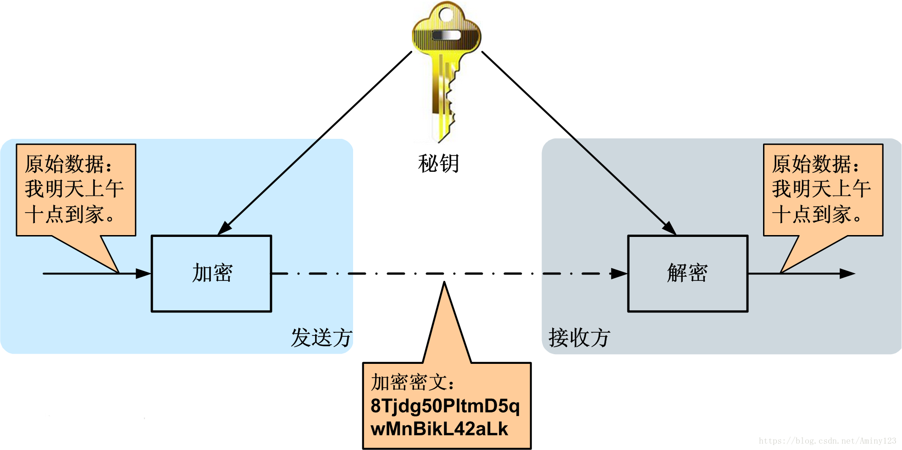

> 课程报告

<link rel="stylesheet" type="text/css" href="../css/auto-title-number.css" />

<!-- more -->

## 目录

- [目录](#目录)
- [课程内容回顾](#课程内容回顾)
- [对称加密与非对称加密](#对称加密与非对称加密)

## 课程内容回顾

在本次“网络空间安全的密码学导引”课程中，我了解了密码学在网络安全领域的应用和重要性。课程内容涵盖了从基础的密码学概念（如对称密码和非对称密码）到复杂的应用场景，包括文件加密、磁盘加密、VPN和即时通信等。通过这些学习，我不仅理解了密码学原理，还学会了如何将这些原理应用于实际问题中，以确保数据的安全性和完整性。

其实作为计算机专业的学生，我在不少课程中都接触过密码相关的技术和应用，譬如RSA、SSH、VPN、HTTPS等等，但都没有一次系统的、从理论到技术的梳理，导致我对很多东西的认知都存在误区，这次课也帮我修正了很多谬误，给我新的认识，尤其是以下关于对称加密和非对称加密的内容。

## 对称加密与非对称加密

> 安全的都消失了，不安全的都留下来了

这两类密码模式其实我们都很熟悉，稍微回顾一下二者的区别。

**对称密码学**
对称密码的加密和解密过程使用相同的密钥。这意味着发送者和接收者必须共享一个密钥，并且双方都需要保守这个密钥的秘密。
* 优点：加密和解密速度快，适合大量数据的处理。
* 缺点：密钥分发是一个挑战，因为任何获得密钥的人都能够解密信息。

常见的对称加密算法包括`AES`（高级加密标准）、`DES`（数据加密标准）和`ChaCha20`等。

**非对称密码学**

非对称密码使用一对密钥：一个公钥和一个私钥。公钥可以公开分享，用于加密数据；私钥必须保密，用于解密数据。这种方法解决了密钥分发的问题，因为即使公钥被他人获取，没有相应的私钥也无法解密信息。非对称加密通常用于加密小量数据，如密钥交换、数字签名等。它在速度上不如对称加密快，但在安全性和密钥管理方面提供了优势。
著名的非对称加密算法有`RSA`、`ECC`和`ElGamal`等。

我第一次学到非对称加密机制后，就惊为天人，感叹数学的美，成为了非对称加密的忠实信徒。以至于在我研一某些项目中遇到需要验证、加密、签名的场景时，我都是自信满满地提出我的非对称加密的设计方案。

此前我在设计APISIX的交互过程时，涉及到身份验证和消息加密传输的任务。当时我在这两个环节都采用了非对称加密的方式：
* 通过约定好集群的公钥，平台使用公钥加密对应握手消息，由集群来用私钥解密，验证对方身份；
* 平台与集群间建立连接后，加密消息的传递仍然采用非对称加密的方式，由平台传递到集群。

记得当时我的老师给我提了意见：传消息的时候用简单的对称加密方式就OK。我当时只是以为在平台建设初期，老师想用简单一点的方式，不要太顾及安全性，降低一下开发的复杂度。直到这次课上，我才发现一直有一个问题躲在我视野的盲区，我一直没有发现：非对称密码固然美，**但美丽是需要代价的！**

非对称加密虽然在安全性上无可挑剔，但在处理大量数据时，其计算复杂度和速度却远不如对称加密。每次加密和解密都需要进行复杂的数学运算，在数据传输量较大时，无疑会大大增加系统的负担。

我意识到，在APISIX的交互过程中，身份验证和消息加密传输是两个不同的场景，它们对安全性和性能的需求也不尽相同。身份验证需要的是安全性和一次性的验证成本，而非对称加密在这里发挥了它的优势。然而，消息传输则涉及到持续的数据交换，对性能的要求更高。

于是我开始重新考虑将非对称加密和对称加密结合起来使用的方案。在身份验证阶段，继续使用非对称加密来安全地交换对称密钥。一旦对称密钥交换完成，便使用这个密钥来加密和解密后续的所有通信数据。这样，我们既保证了密钥交换的安全性，又利用了对称加密的高效率来处理大量数据的传输。

此外，我也认识到了数字签名在确保数据完整性和来源认证中的重要性。在消息传输过程中，除了使用对称加密保护数据的机密性，还可以使用非对称加密的数字签名来确保数据的完整性和认证，这样既提高了效率，又没有牺牲安全性。

这次课程的学习让我深刻理解到，技术的选择应该基于实际需求和场景的考量。非对称加密和对称加密各有所长，合理地结合使用，才能在保证安全的同时，达到最优的性能表现。这不仅是一个技术问题，更是一种平衡艺术。

同时，还需要注意到，这是一门日新月异、高度受算力、智能制约的技术。在计算机变得更加智能、更快、更强，量子计算等高性能计算方式如火如荼的情况下，也许有一天，技术还是原来的技术，但其优劣、性能就大大不同了，那时便可能是“攻守之势异也”了。

