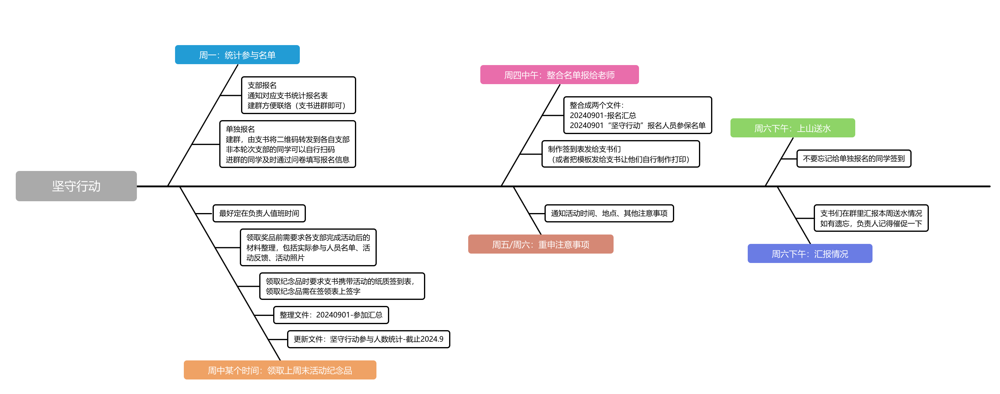
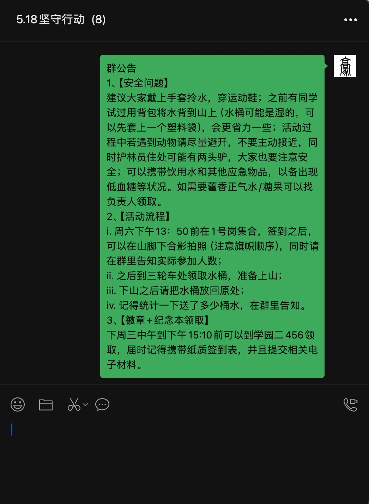
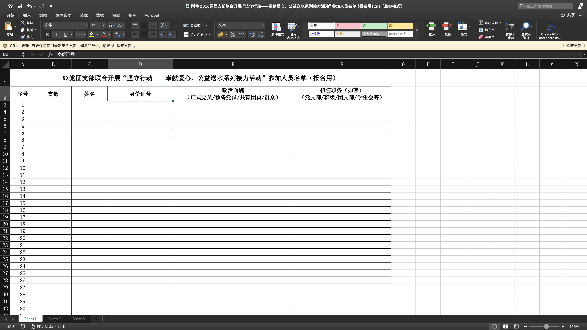
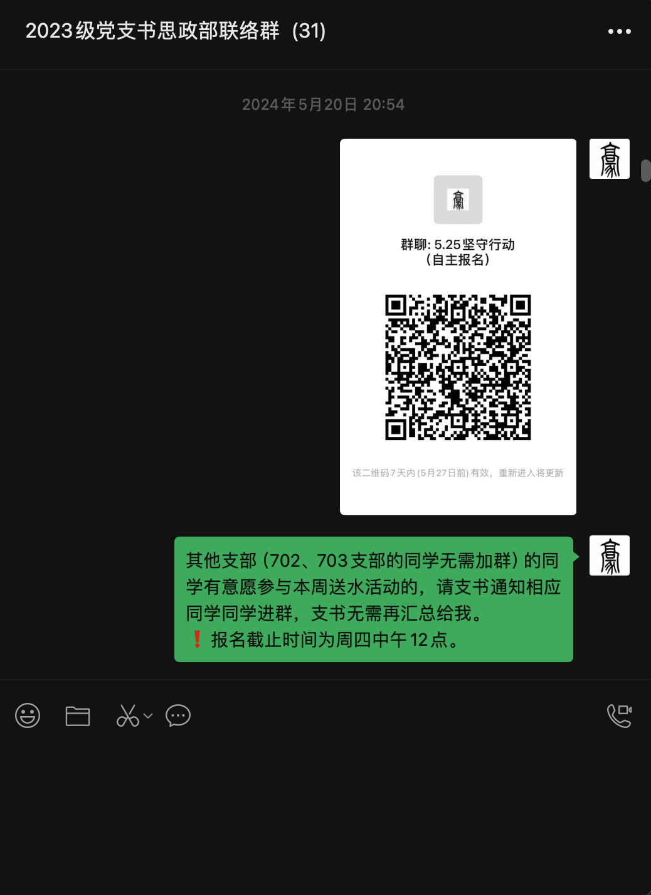
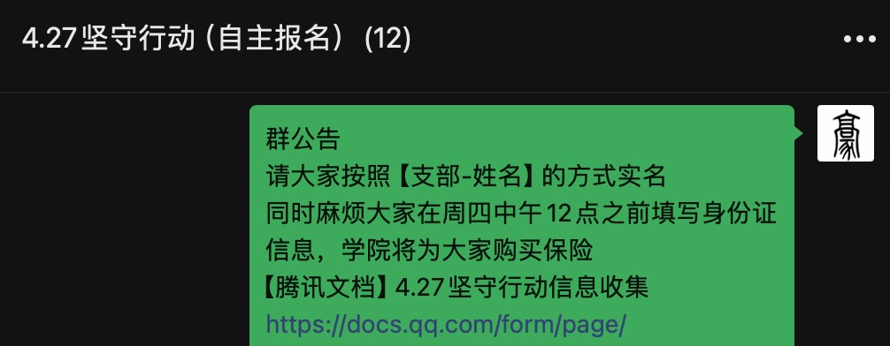
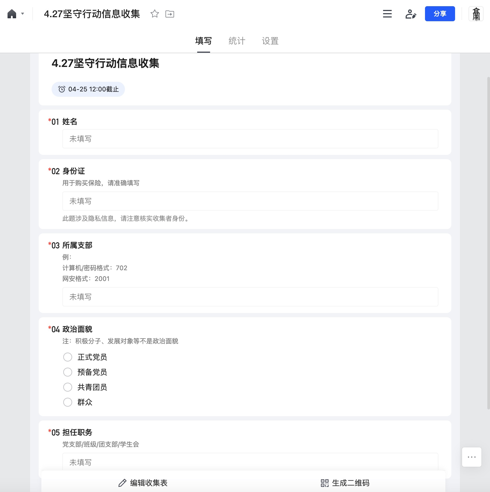

<!-- ###### 说明： -->

<!-- more -->

<link rel="stylesheet" type="text/css" href="../css/auto-title-number.css" />

## 目录

- [目录](#目录)
- [整体流程](#整体流程)
- [统计报名名单](#统计报名名单)
  - [支部报名](#支部报名)
  - [单独报名](#单独报名)
- [整合上报名单](#整合上报名单)
- [强调注意事项](#强调注意事项)
- [上山送水](#上山送水)
- [收尾工作](#收尾工作)
- [其他](#其他)

##  整体流程

<!-- 导入鱼骨图 -->

|时间|事件|
|:-:|:-:|
|星期一|[统计报名名单](#统计报名名单)|
|星期二||
|星期三|[收尾工作](#收尾工作)|
|星期四|[整合上报名单](#整合上报名单)|
|星期五|[强调注意事项](#强调注意事项)|
|星期六|[上山送水](#上山送水)|
|星期日||

## 统计报名名单

一般在`周一`工作时间进行通知。

学期初会编排本学期的送水名单，确定好每个支部在什么时间上山送水，负责人依照安排进行联系。

### 支部报名

负责人首先需要确定本周参加活动的支部（非当周轮次的支部后文统一称为“其他支部”），将相关模板（一般是指报名名单模板，实际参与名单、活动反馈两个文件的模板也可以一起打包发送）发给支部负责人（一般是支书），告知支书们提交的截止时间。并建立该次活动的联络群（邀请支书进群即可）。

报名模板格式类似下图所展示的形式，以老师下发的为准。因为要购买保险，所以`姓名`和`身份证`务必填写正确，负责人可以根据身份证的规则自行检测一下是否存在规则上的错误（之前写过的小工具：[身份证校验](https://ifzzh.github.io/ID-Verification/)，直接将excel一列中的身份证号选中复制粘贴到输入框即可）。

### 单独报名

由于同学们时间安排难以统一，有些同学无法参加其支部所在轮次的活动，因此可以开放一个单独报名的渠道，供其他支部的同学报名。我采取的方式是每周建立一个单独报名的联络群，分享到支书联络小群里，由支书转发给班级同学，同学们自行扫码进群。

由于没有支部牵头，所以这一部分同学需要由负责人单独统计。我采取的方式是建群后在公告中放一个在线问卷的链接，告知截止日期；截止报名之后将问卷结果直接导出到表格中。

问卷需要统计的信息大致如下图所示：

## 整合上报名单

在截止报名之后，将手中的名单文件整合到一个大的文件里，

## 强调注意事项

## 上山送水

## 收尾工作

## 其他

切记避免泄露同学们的隐私

<!--  -->

<!-- <iframe id="embed_dom" name="embed_dom" frameborder="0" style="display:block;margin-left:0px; margin-top:0px;width:750px; height:475px;" src="https://www.processon.com/embed/66d2bc9e3cb1c722bb5a45b2?cid=66d2bc9e3cb1c722bb5a45b5"></iframe> -->

<!--  -->