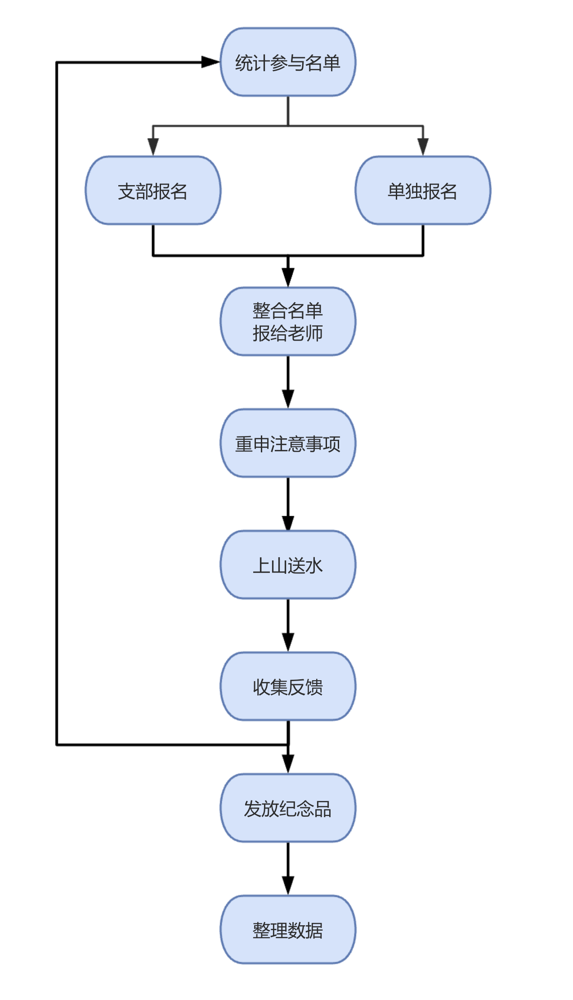
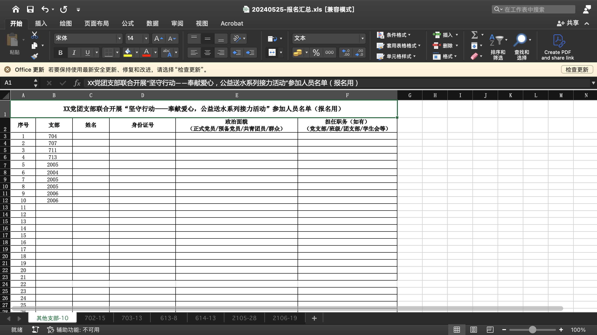
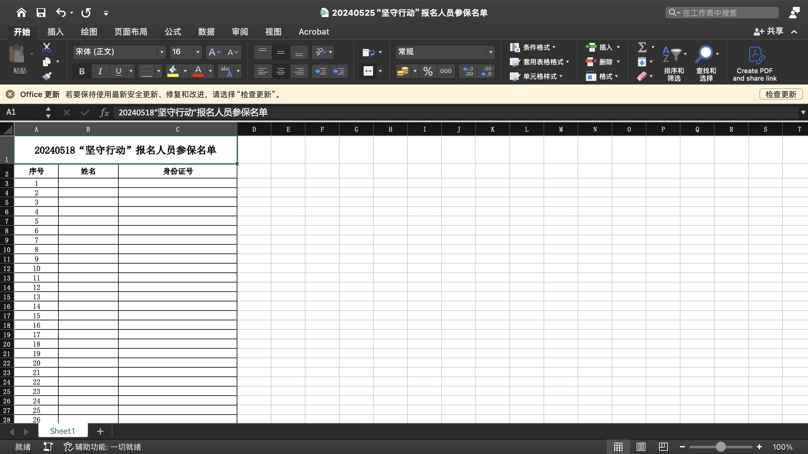
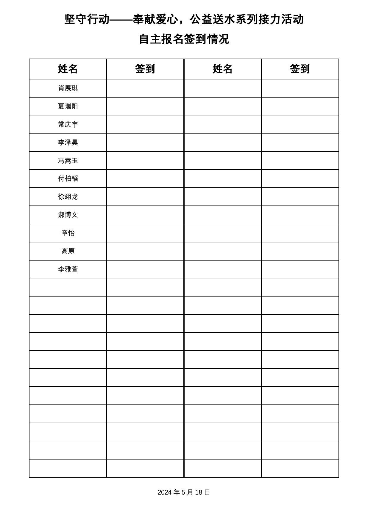
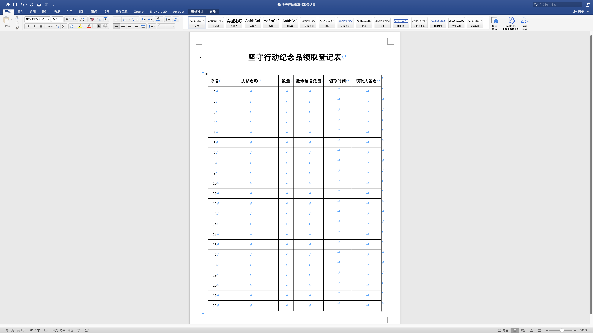
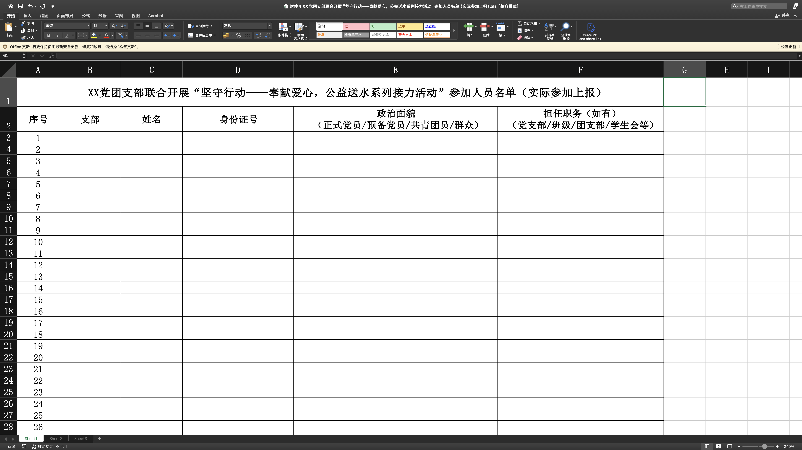
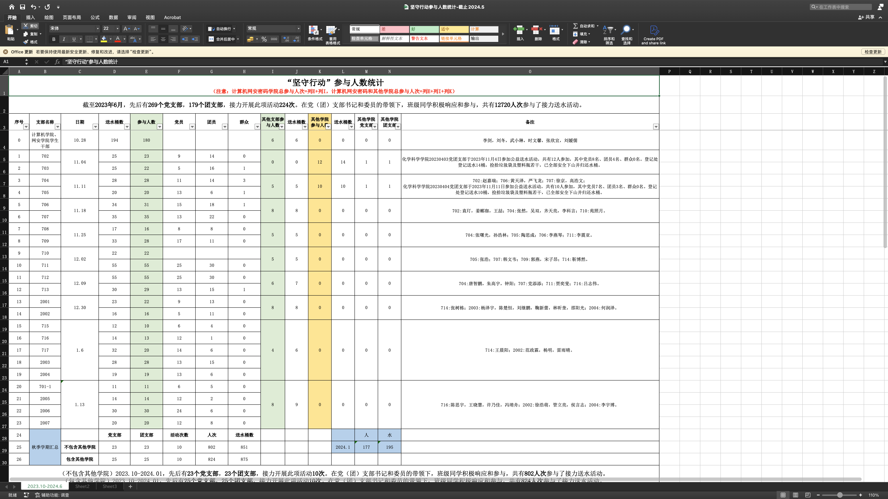

<!-- ###### 说明： -->

<!-- more -->

<link rel="stylesheet" type="text/css" href="../css/auto-title-number.css" />

## 目录

- [目录](#目录)
- [整体流程](#整体流程)
- [统计报名名单](#统计报名名单)
  - [支部报名](#支部报名)
  - [单独报名](#单独报名)
- [整合上报名单](#整合上报名单)
- [强调注意事项](#强调注意事项)
- [上山送水](#上山送水)
- [收尾工作](#收尾工作)
  - [回收签到表及坚守行动的旗帜](#回收签到表及坚守行动的旗帜)
  - [发放纪念品](#发放纪念品)
  - [收集电子材料](#收集电子材料)
  - [整理汇总文件](#整理汇总文件)
- [其他](#其他)

##  整体流程

    

<!-- 导入鱼骨图 -->
<!--  -->

    

|时间|事件|
|:-:|:-:|
|星期一|[统计报名名单](#统计报名名单)|
|星期二||
|星期三|[收尾工作](#收尾工作)|
|星期四|[整合上报名单](#整合上报名单)|
|星期五|[强调注意事项](#强调注意事项)|
|星期六|[上山送水](#上山送水)|
|星期日||

## 统计报名名单

一般在`周一`工作时间进行通知。

学期初会编排本学期的送水名单，确定好每个支部在什么时间上山送水，负责人依照安排进行联系。

### 支部报名

负责人首先需要确定本周参加活动的支部（非当周轮次的支部后文统一称为“其他支部”），将相关模板（一般是指报名名单模板，实际参与名单、活动反馈两个文件的模板也可以一起打包发送）发给支部负责人（一般是支书），告知支书们提交的截止时间。并建立该次活动的联络群（邀请支书进群即可）。

<!--  -->

    

报名模板格式类似下图所展示的形式，以老师下发的为准。因为要购买保险，所以`姓名`和`身份证`务必填写正确，负责人可以根据身份证的规则自行检测一下是否存在规则上的错误（之前写过的小工具：[身份证校验](https://ifzzh.github.io/ID-Verification/)，直接将excel一列中的身份证号选中复制粘贴到输入框即可）。

### 单独报名

由于同学们时间安排难以统一，有些同学无法参加其支部所在轮次的活动，因此可以开放一个单独报名的渠道，供其他支部的同学报名。我采取的方式是每周建立一个单独报名的联络群，分享到支书联络小群里，由支书转发给班级同学，同学们自行扫码进群。

<!--  -->

    

由于没有支部牵头，所以这一部分同学需要由负责人单独统计。我采取的方式是建群后在公告中放一个在线问卷的链接，告知截止日期；截止报名之后将问卷结果直接导出到表格中。

<!--  -->

    

问卷需要统计的信息大致如下图所示：

<!--  -->

    

## 整合上报名单

一般需要在`周四中午`前将下述两个文件发送给老师（主要是参保名单），需要留足时间购买保险。

在截止报名之后，将手中的名单文件整合到一个大的Excel文件中，每个sheet保存一个支部的信息，单独报名的同学整合到同一个sheet中。可以在sheet名字中标注对应的人数，方便计算、统计。

<!--  -->

    

将姓名和身份证两列单独提取出来，保存为参保名单。

    

制作签到表，交由支书们自行打印（如果负责人不到现场的话）；也可以直接将模板发送给支书，让他们自行制作。同时可能需要委托一位同学协助单独报名同学的签到。我当时制作得比较潦草，负责人可以重新制作一版，优化一下。重新制作的话建议不要忘记加上活动日期。

    

## 强调注意事项

在`周五`或`周六中午前`，即在活动开始前通知到位。

需要强调的事项主要有以下几个：
1. 安全问题
   * 拎水的话建议戴上手套
   * 穿舒适运动鞋
   * 可以用背包将水背到山上（水桶可能是湿的，可以先套上一个塑料袋），会更省力一些
   * 活动过程中若遇到动物请尽量避开，不要主动接近
   * 护林员住处可能有两头驴，大家也要注意安全
   * 可以携带饮用水和其他应急物品，以应对`低血糖`等状况
   * 如需要`藿香正气水/糖果`可以找负责人领取（当时我是临时买的，今年可以看看能不能走报销流程，没有的话这一条可以不加）

2. 活动流程
   * 周六下午13：50前在1号岗集合
   * 签到
   * 在群里告知实际参加人数
   * 可以在山脚下合影拍照（注意旗帜顺序）
   * 到三轮车处领取水桶，准备上山
   * 下山之后请把水桶放回原处
   * 记得统计一下送了多少桶水，在活动群里告知

3. 后续任务
   * 各位支书在支书群（非活动群）向老师汇报情况
   * 负责人汇报单独报名的同学的情况
   * 负责人通知支书们何时去何地领取纪念品、提交纸质签到表，何时提交电子材料

## 上山送水

一般是在`周六`下午。

向同学们重申安全问题。提醒支书们签到、统计人数、统计送水数量。

在活动结束后提醒支书们到支书群汇报活动情况。

## 收尾工作

最好在负责人值班时间进行。主要有以下几件事情：

### 回收签到表及坚守行动的旗帜

各位支书提交活动的纸质签到表，以及坚守行动的旗帜。负责人将签到表留好以备日后校对，同时准备将旗子交给下一次活动的支书们。

### 发放纪念品

我们这一届的纪念品是徽章和本子，徽章是有编号的，记得按编号发放。（数量较多，可能得提前数好）

记得做好记录！签领时需要记录徽章标号范围和纪念品数量。

    

### 收集电子材料

要求支书们在领取纪念品之前提交电子材料，主要包括实际参加的人员名单，模板与报名名单类似。

    

除了实际参加的人员名单之外，支书还需要提交活动反馈文件以及活动相关的媒体文件，负责人代为保存。

### 整理汇总文件

与报名汇总类似的，整理好参加汇总文件（建议每周收集完就整理，方便后期统计）。

    

更新总的坚守行动参与人数统计文件方便日后计算。

    

## 其他

1. ⚠️切记避免泄露同学们的隐私！
2. 冬天天气很冷，没有手套比较难受。看看是否能够将手套纳入清单一并购置
3. 夏天天气干燥炎热，出现过几次同学中暑、低血糖的情况，可以考虑购置一些补糖、防暑的物资
4. 之前有同学建议在中途设置休息点，可以考虑

<!--  -->

<!-- <iframe id="embed_dom" name="embed_dom" frameborder="0" style="display:block;margin-left:0px; margin-top:0px;width:750px; height:475px;" src="https://www.processon.com/embed/66d2bc9e3cb1c722bb5a45b2?cid=66d2bc9e3cb1c722bb5a45b5"></iframe> -->

<!--  -->